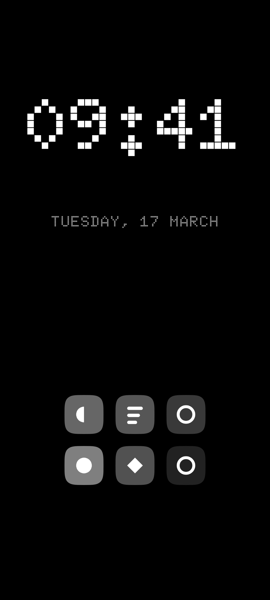
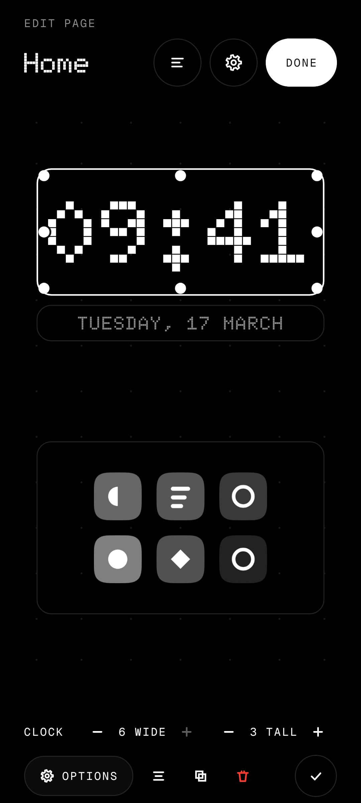
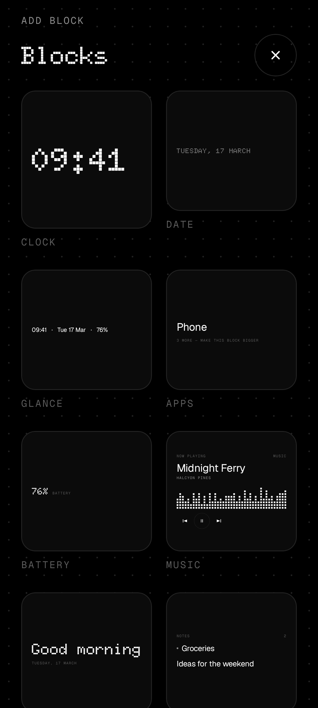
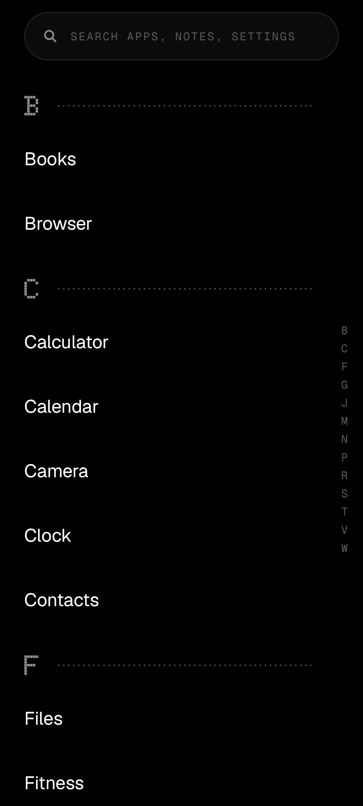
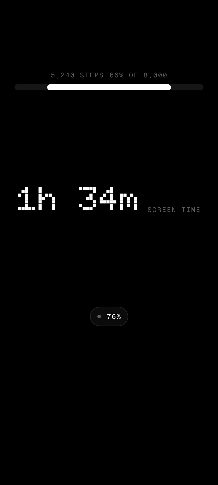
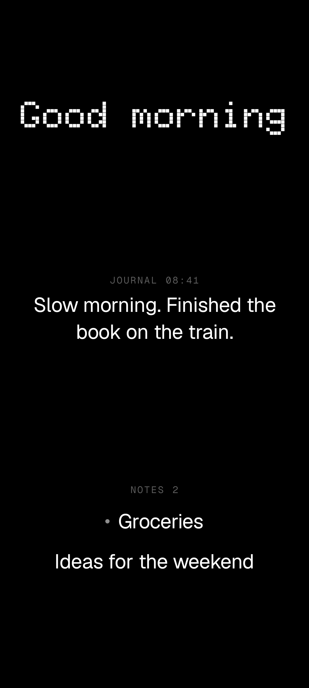
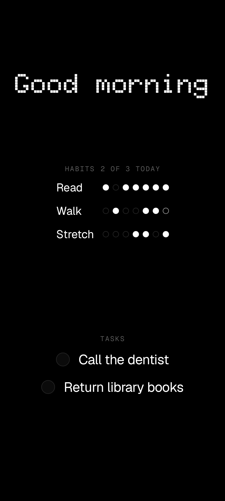
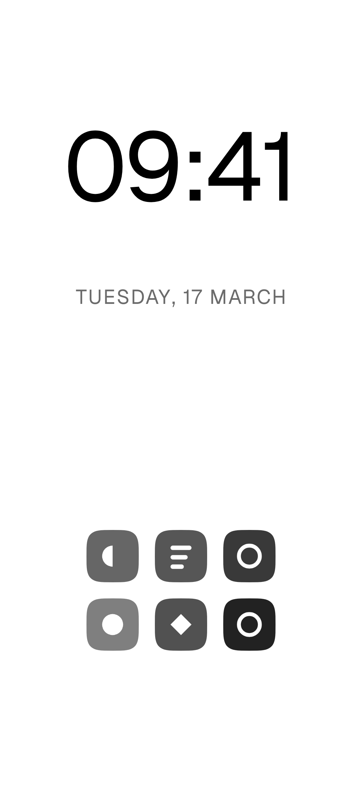

# Nulis

A home screen made of blocks.

Nulis is a minimal Android launcher that is also deeply customisable. A **page is exactly one
screen** — a 6 × 12 grid — and a **block** is a rectangle on it: a clock, the date, your apps, what
is playing, a note, your habits, a real Android widget, a cat walking across the screen. Nothing
scrolls, nothing is taller than the screen, and empty space is allowed and normal.

It is offline forever. There is no `INTERNET` permission, no analytics, no crash reporter and no
account. Nothing you type into it can leave the phone, and you can check that yourself in one
command — see [Privacy](#privacy).

<p align="center">
  
  
  
  
</p>
<p align="center">
  
  
  
  
</p>
<p align="center"><em>Rendered by the screenshot tests from the real code, with demo apps that belong to nobody.</em></p>

---

## Two things to choose between

Not three. A **Layout** says what is on which page and how many pages there are. A **Look** and its
**Colours** say how it is all drawn. The two are independent, so any layout works with any look,
and "save this setup" keeps the pair under a name you choose. There are no themes.

### Pages

Up to five, in swipe order, with **home** a mark on whichever one you choose rather than a
position. Add, remove and reorder them in Settings → Layout → Pages, where each one is a live
miniature of itself.

### Editing happens on the real page

Long-press anywhere — a block or the empty space beside it — and the page you were looking at
scales back, the grid appears and every block gets an outline. From there:

- **Drag a block** and it follows your finger. Neighbours make room; when there is nowhere for a
  displaced block to go the whole move is refused rather than half done.
- **Pull a knob** — four corners and four edge midpoints — to resize a cell at a time, or use the
  **size steppers** in the bottom bar, which never need you to land on anything small.
- **Pick a block up** and the bottom bar becomes that block's: its name, its size, Options, align,
  duplicate, delete. It never covers the block next to the one you are working on.
- **Add** drops a new block in the first space that fits it. **Undo** takes back the last twelve
  things you did.

### Blocks

27 block types. Every style survives any legal rectangle - a word or a number is never broken to
fit, the block shrinks instead, every style honours the page's
alignment, and every block that has nothing to show yet draws the *shape* of what it will hold —
ruled lines for something you write on, an unticked box for a checklist, a readout reading zero —
rather than a sentence telling you what to do.

| | |
|---|---|
| **Clock** | 18 styles: display, stacked, mono, outline, vertical, flip, analog, analog-dot, seconds ring, roman, binary, words, dual timezone, corner, seven-segment, bars, rings, day arc |
| **Date** | 8 styles, from a quiet line under the clock to a full-bleed ghost month |
| **Glance** | One line with the slots you choose: time, date, battery, steps, screen time, next alarm, now playing |
| **Apps** | As many of your chosen apps as the rectangle holds, as a list or a grid, with their own icon style |
| **Widget** | One real Android widget, hosted inside the block, resized with it, optionally in grey. Widgets with a setup screen get it, and can be set up again |
| **Battery** | 6 shapes: percent, segments, pill, ring, cell, gauge |
| **Steps** | 7: number, progress, seven-day chart, walker, ring, dots, today against your average |
| **Screen time** | 5: total, top three, donut, split bar, a dot grid of five-minute blocks. Counts time in apps, and shows time with the screen on (what Digital Wellbeing reports) beside it |
| **Music** | 6: beat bars, minimal, art, compact row, spinning vinyl, marquee |
| **Your week** | The way in to the seven-day summary, from a page rather than from settings |
| **Notes, Journal, Tasks** | Writing that lives on the home screen and autosaves |
| **Habits** | 3: a week of dots per habit, today's habits as pills, the longest streak. Tap to tick today |
| **Countdown** | Days or a bar to a date you choose |
| **Quote** | 32 public-domain lines, a new one each day |
| **Calculator** | A display, or a working keypad on the page |
| **Calendar** | A week strip, or your agenda if you grant the permission |
| **Contacts** | People you call often — no permission, it uses the system picker |
| **Photo** | One picture, optionally dithered to dots to match the look |
| **Focus** | A session timer that dims the rest of the page |
| **Fun** | Dot cat, Game of Life, a pet, an hourglass |
| **Greeting, Spacer** | The glue |

### Layouts

**Eight** — Minimal, Compact dashboard, Just a clock, Bottom dock, Stats, Writer, Terminal, Paper —
are arrangements and nothing else: picking one never touches your colours or your type. The picker
is a full-height live preview of each, drawn with this phone's own clock, battery and apps.

### Looks and colours

Two looks — **DOT** (Doto, dotted hairlines) and **CLEAN** (thin Geist, solid hairlines) — and
black, white, **Auto** (following the phone's dark mode), or any background you like with a text colour of your own and a contrast readout
that says in plain words when the pair is too close to read. Eight palettes set background, text
and accent together, and a ninth is drawn from your wallpaper's own colours. The accent is yours; red stays reserved for destructive actions, so "delete"
never looks like "selected".

### Typography

Six open-licensed faces (Doto, Geist, Noto Sans, Noto Serif, Geist Mono, Noto Mono). Choose the
display face and the body face separately, scale all text at once, and turn small mono captions
uppercase or leave them alone. Every licence is readable inside the app.

### App drawer

Search, an A–Z rail, your own groups, hidden apps, an optional recents row, and apps you have not
opened in 30/60/90 days quietly resting out of the way. The search field is also a calculator
(`12*12`, `1 km in m`) and finds your notes, your open tasks and any settings section by name.

It lives wherever you want it: **swipe up** (the default), a **page of its own** on the far left or
the far right, or **off** — and moving it off the upward swipe hands that gesture back to you.

### Gestures, wellbeing, and the rest

- Swipes, taps and long-presses are remappable. Whatever you map them to, one way back into
  Settings is always kept open, so the launcher cannot be configured into a dead end.
- **Notification dots** are optional and off by default: a dot on apps with something waiting, and
  only that — never a count, a sender or a preview.
- **Wellbeing.** A mindful pause before apps you choose, a weekly summary, and a focus mode that
  dims what you asked it to. No Accessibility Service, ever.
- **Backup and restore.** One plain-text JSON file with everything in it, written and read through
  the system file picker. No permission needed.
- **Sound.** Eight short synthesised tones for selections and toggles, off by default, generated at
  runtime — no audio files.
- **Accessibility.** Every block and every tappable thing has a spoken name, and a test fails the
  build if one does not; the pages go quiet while something covers them; everything fits at the
  largest font scale; a Higher contrast setting lifts captions to 4.5:1; animation stops when the
  system says reduce motion; on a tablet, blocks grow with their cells.
- **Learnable without a tutorial.** Until each gesture has been used once, a quiet line along the
  bottom of the home page says what it does - swipe up for apps, hold to edit, swipe sideways
  for pages - acted out by a small glyph. Each goes away for good the first time you do it.

## Privacy

Nulis has no `INTERNET` permission. It cannot make a network request even if it wanted to, because
Android will not let a process without that permission open a socket. Check it yourself:

```bash
adb shell dumpsys package com.nulis.launcher | grep -A 40 'requested permissions'
```

`android.permission.INTERNET` is not in the list, and never will be. Or read the manifest in this
repository: [`app/src/main/AndroidManifest.xml`](app/src/main/AndroidManifest.xml).

Four permissions are declared, plus notification access. All but one are optional, asked for only
behind an explanation screen you can decline, and only when you use the feature that needs them.
See [PRIVACY.md](PRIVACY.md).

| Permission | For | Optional |
|---|---|---|
| `PACKAGE_USAGE_STATS` | Screen-time block, resting unused apps, recents row | Yes — granted by you in system settings |
| `ACTIVITY_RECOGNITION` | Steps block | Yes |
| `READ_CALENDAR` | Calendar block's agenda styles (the week strip works without it) | Yes |
| Notification access | The music block, and the optional notification dot | Yes — granted by you in system settings |
| `EXPAND_STATUS_BAR` | The "pull down the notification shade" gesture | Install-time, normal protection; it opens a panel and reads nothing |

## Build

Requires JDK 17+ (21 for the screenshot tests) and the Android SDK (compileSdk 36). Minimum
supported Android is 8.0 (API 26).

There are two flavors of one app: **play**, which goes to Google Play and contains no donation or
payment link of any kind (Play's payments policy), and **github**, the same plus a "Buy me a
coffee" row in About. Everything else is identical, down to the package name.

```bash
./gradlew assemblePlayPerf
```

`perf` is the build type to use for anything you intend to judge: release-optimised (R8, not
debuggable) but signed with the debug key, so it installs over a debug build and keeps its data.
The `debug` build is 5–10× slower per frame and must never be used to measure feel.

```bash
adb install -r app/build/outputs/apk/play/perf/app-play-perf.apk
adb shell am start -n com.nulis.launcher/.MainActivity
adb shell am broadcast -a androidx.profileinstaller.action.INSTALL_PROFILE \
  -p com.nulis.launcher/androidx.profileinstaller.ProfileInstallReceiver
adb shell cmd package compile -m speed-profile -f com.nulis.launcher
```

Tests and lint:

```bash
./gradlew testPlayPerfUnitTest testPlayDebugUnitTest lintPlayPerf lintGithubPerf
```

The JVM unit tests cover the pure logic — expression evaluation, the grid and its migrations, the
"make room" invariant the editor commits against, block settings, layout and setup application,
the whole drawer model, gesture lock-out rules, wellbeing rules, the backup format, habits and
streaks, screen-on time, tone synthesis, palette and caption contrast, and the design tokens.
Lint runs with `warningsAsErrors = true`.

`testPlayDebugUnitTest` also runs the **screenshot tours**: Robolectric drives the real launcher
through onboarding, the home pages, the editor, the drawer and every settings screen, and renders
every style of every block in both looks on black and white. A screen that crashes, or a tappable
thing a screen reader cannot name, fails the build. To see them:

```bash
./gradlew recordRoborazziPlayDebug     # images in app/build/screenshots/, store ones in docs/store/
```

### Releases

`scripts/make-release-key.sh` makes a release key on your own computer, in `~/.nulis-release/`,
outside the repository. With it, `./gradlew bundlePlayRelease` makes the Play bundle and
`./gradlew assembleGithubRelease` the GitHub APK; without it, the same commands make unsigned
builds. Every push to `main` builds the github flavor in CI and attaches it to a rolling `latest`
prerelease; a `v*` tag makes a proper release. The store listing, graphics, Data safety answers and
the Play Console walkthrough are in [`docs/store`](docs/store).

## How it is put together

Kotlin and Jetpack Compose only. No XML layouts, no Java, and a dependency list you can read in one
breath: AndroidX core, activity, lifecycle, DataStore, kotlinx-serialization, coroutines and
Compose.

```
com.nulis.launcher
├── apps/          installed apps, categories, usage, work profiles
├── backup/        one plain-text file in, one out
├── blocks/        one sub-package per block type
├── drawer/        the drawer, and buildDrawer() — every rule about what it shows
├── gestures/      what swipes, taps and long presses do
├── home/          the page, the grid, the editor
├── icons/         icon styles, packs, per-app overrides, the cache
├── layout/        page persistence, the page list, the eight shipped layouts
├── notifications/ which apps have something waiting, and nothing else
├── onboarding/    the first-launch flow
├── settings/
├── setups/        a whole phone saved under a name
├── ui/theme/      Looks, colours, type, motion, haptics, sound
├── ui/components/
├── wellbeing/     pauses, focus, the weekly summary
└── widgets/       the AppWidgetHost and the Widget block
```

**Adding a block type** means writing one `BlockDefinition` and adding it to
`BlockRegistry.definitions`. Nothing else changes: the definition reads and writes its own
settings, renders its own options, declares its minimum size, and supplies the sample data its
preview uses.

**Adding a style** means one `BlockStyle` in that definition's `styles` list.

All UI is built from `ui/theme` tokens and `ui/components` — a screen never hardcodes a font, a
colour or a divider. See [CLAUDE.md](CLAUDE.md) for the full house rules.

## Contributing

Issues and pull requests are welcome. Before opening a PR:

- Read [CLAUDE.md](CLAUDE.md). It is the house style, and it is short: Kotlin and Compose only, no
  new permissions or dependencies without a clear need, no network anything ever, and every UI
  built from the design tokens.
- `./gradlew testPlayPerfUnitTest testPlayDebugUnitTest lintPlayPerf lintGithubPerf assemblePlayPerf`
  must pass. Lint treats warnings as errors.
- Keep the offline promise. A patch that adds `INTERNET`, an analytics SDK or a crash reporter will
  be declined however useful it is.
- Say what you saw on a real phone. This project is judged by how it feels, not by how it reads.

By contributing you agree that your contribution is licensed under GPL-3.0-or-later.

## Fonts

Doto, Geist, Geist Mono and the Noto faces, all under the SIL Open Font License. The licence text
ships in `app/src/main/assets/licenses` and is readable from Settings → Look and colours → Font
licences. No other company's fonts, names or logos appear anywhere in the app or its icon.

## Licence

GPL-3.0-or-later. See [LICENSE](LICENSE).

The bundled fonts keep their own SIL Open Font License; the GPL applies to Nulis's own code and
assets, not to them.

## Status

Version 1.0.0. Used daily; ready for Google Play and GitHub releases.
